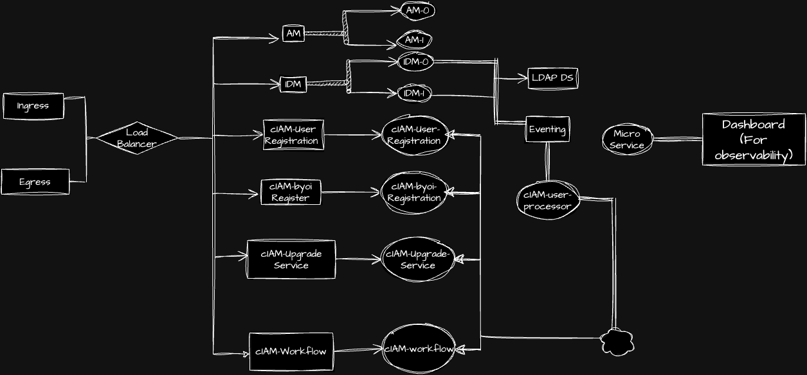

<!--This framework is deployed on premises provided by a 3rd party vendor through a cloud based subscription model or deployed in a hybrid model.-->

## What is Customer Identity and Access Management (cIAM)?

It is a platform for business process and policies that facilitate management of digital identities. We use this to control user access to critical information in an enterprise. It helps securely store profile data and even provides data governance functions to ensure only necessary data is shared.

CIAM solutions usually provide a combination of features which may include customer registration, self-service account management, consent and preference management, a single sign-on solution (SSO), a multi-factor authentication (MFA) solution, access management, authorization, directory services, data access governance, identity proofing, identity orchestration, and even threat detection and fraud mitigation.

Here at Maersk, we use federated identities which can be translated to a system where a user can access multiple platforms and services with a single set of credentials.

### What does cIAM look after?

- How individuals are identified in a system
- How roles are identified in a system and they are assigned to individuals
- adding, removing, and updating individuals and their roles
- assigning levels of access
- protecting sensitive information within the system and securing system itself

### How many components does cIAM have?

**1. Access Management (AM):** AM provides a service called access management, which manages access to resources, such as a web page, an application, or a web service, that are available over the network. Once it is set up, AM provides an infrastructure for managing users, roles, and access to resources. AM centralizes access control by handling both authentication and authorization.

**2. Identity Management (IDM):** Identity Management (IDM) software provides centralized, simple management and synchronization of identities for users, devices, and things. IDM software is highly flexible and therefore able to fit almost any use case and workflow. IDM can make it easier to track user identities across these resources. IDM has a highly scalable, modular, readily deployable architecture that can help you manage workflows and user information.

**3. Directory Services (DS):** They are specialized software systems or databases designed to store, organize, and manage information about users, resources, and their relationships within an organization. These services provide a centralized repository for user identities, access control policies, and related information. Directory services are used to facilitate efficient authentication, authorization, and access management across various IT resources.

## Benefits of Identity and Access Management

IAM offers a wide range of benefits to organizations of all sizes by helping them manage and secure user identities, permissions, and access to their systems and data. Here are some key benefits of IAM:
 
|Terms                                                | Description                                                                                                                                                                                                                                                               |
|-----------------------------------------------------|---------------------------------------------------------------------------------------------------------------------------------------------------------------------------------------------------------------------------------------------------------------------------|
| 1. Enhanced Security:                               | IAM provides centralized control over user access reducing the risk of unauthorized access to critical systems and data.It enables the implementation of strong  authentication methods such as multi-factor authentication (MFA) to protect against unauthorized access. |
|                                                     |                                                                                                                                                                                                                                                                           |
| 2. Improved Compliance:                             | IAM helps organizations meet regulatory compliance requirements by providing audit trails and access control policies that demonstrate adherence to security standards.                                                                                                   |
|                                                     |                                                                                                                                                                                                                                                                           |
| 3. Efficient User Provisioning and De-provisioning: | IAM streamlines the process of granting and revoking access to resources making it easier to onboard new employees and terminate access for departing ones.                                                                                                               |
|                                                     |                                                                                                                                                                                                                                                                           |
| 4. Reduced Administrative Overhead:                 | Automation and self-service capabilities in IAM reduce the manual effort required for user management, password resets and access requests.                                                                                                                               |
|                                                     |                                                                                                                                                                                                                                                                           |
| 5. Granular Access Control:                         | IAM allows organizations to define and enforce fine-grained access policies ensuring that users have the minimum level of access required to perform their job functions.                                                                                                 |
|                                                     |                                                                                                                                                                                                                                                                           |
| 6. Increased Productivity:                          | With the right access permissions in place employees can quickly access the resources they need to do their jobs reducing friction and improving productivity.                                                                                                            |
|                                                     |                                                                                                                                                                                                                                                                           |
| 7. Auditing and Monitoring:                         | IAM systems provide detailed logs and monitoring capabilities helping organizations track user activities and detect suspicious behavior.                                                                                                                                 |
|                                                     |                                                                                                                                                                                                                                                                           |
| 8. Password Management:                             | IAM solutions often include features for password management ike password policies, self-service password resets and password synchronization.                                                                                                                            |
|                                                     |                                                                                                                                                                                                                                                                           |
| 9. Single Sign-On (SSO):                            | SSO simplifies the user experience by allowing users to log in once and access multiple applications and services without the need for multiple passwords.                                                                                                                |
|                                                     |                                                                                                                                                                                                                                                                           |
| 10. Scalability:                                    | IAM systems can scale to accommodate the growing number of users, devices and resources in an organization.                                                                                                                                                               |
|                                                     |                                                                                                                                                                                                                                                                           |
| 11. Improved Collaboration:                         | IAM can facilitate secure collaboration by enabling external users (partners, contractors, customers) to access specific resources without compromising security.                                                                                                         |
|                                                     |                                                                                                                                                                                                                                                                           |
| 12. Cost Reduction:                                 | By automating user management tasks, by reducing the risk of security breaches and minimizing the impact of data breaches. Hence,IAM can lead to cost savings in the long run.                                                                                            |
|                                                     |                                                                                                                                                                                                                                                                           |
| 13. Flexibility:                                    | IAM solutions can be tailored to an organizations specific needs and integrated with existing systems and applications.                                                                                                                                                   |
|                                                     |                                                                                                                                                                                                                                                                           |
| 14. Risk Mitigation:                                | IAM helps mitigate the risk of insider threats and external attacks by ensuring that only authorized users have access to sensitive data and systems.                                                                                                                     |
|                                                     |                                                                                                                                                                                                                                                                           |

In summary, IAM is a crucial component of modern cybersecurity and access control strategies, providing organizations with enhanced security, compliance, efficiency, and control over user access. It helps organizations protect their data, streamline user management processes, and adapt to changing security needs and regulatory requirements.

## Our Sites


  
  
  
  
  
  


## What is new?

- Maersk SSO
- Maersk Go
