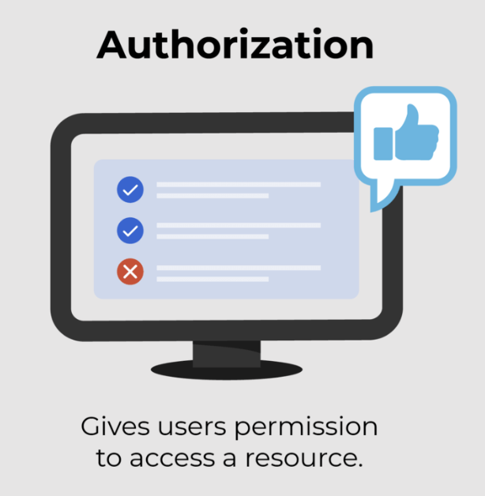
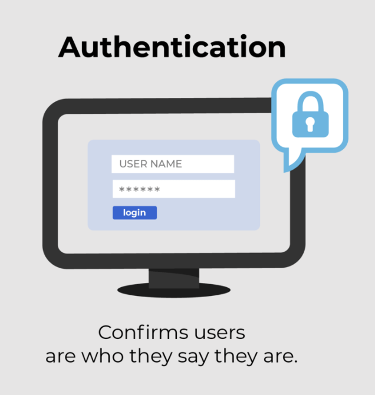

The access management journey starts with identifying a user.

## Authorization

It is the act of determining the actions a user can do.

## Authentication

It is the act of confirming a user's identity through a set of credentials which is tightly coupled with authorization. 

Together, they help us verify a user is who they say they are and also have access to the right subset of information.

Authentication and authorization rely on a user directory to identify users and validate their **[privileges](## "Permissions and rights granted to individuals, processes, or systems, allowing them to perform specific actions or access certain resources within an organization's IT environment")**. 
Identity management is a crucial element, encompassing the ability to manage users and assign them **[roles](## "Roles are collections of permissions and privileges that are assigned to users or groups based on their job functions, responsibilities, or other criteria.")** and **[permissions](## "Permissions refer to the individual access rights or actions that are granted to users, roles, or groups regarding specific resources or data within an organization's IT environment")**. 

## What Happens At Maersk?

At Maersk, we must verify both the user's identity and their association with a business. According to the category/role of the user, their identity and roles can be added, updated or deleted from the user directory. In logistics, companies may invite others to handle specific parts of their logistics journey. In such cases, we need to grant users from one company access to another company's data.

