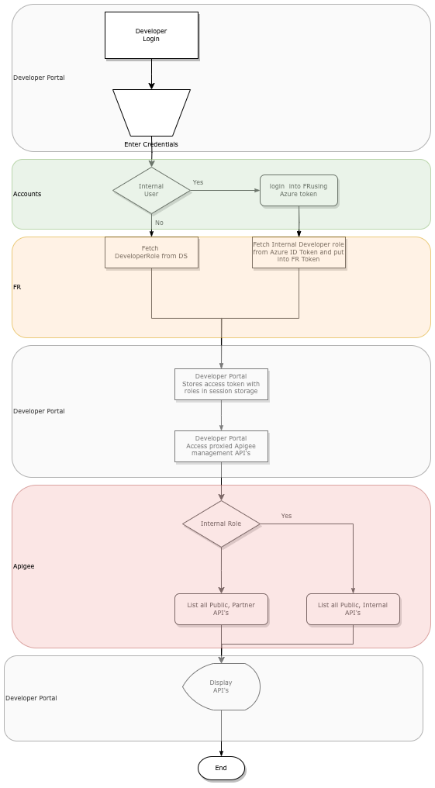

**IAM team also manages developer identity and works with the API gateway to issue tokens for the developer.** Developers with the right privileges can create apps on developers portal and request access to an API product. On creating an app a request is made to provision a **[confidential client](## "Client application that is capable of securely storing and maintaining its client credentials")** on our authorisation server. The app owner will get a token using OAuth2 flows like client credential flow and pass this downstream

