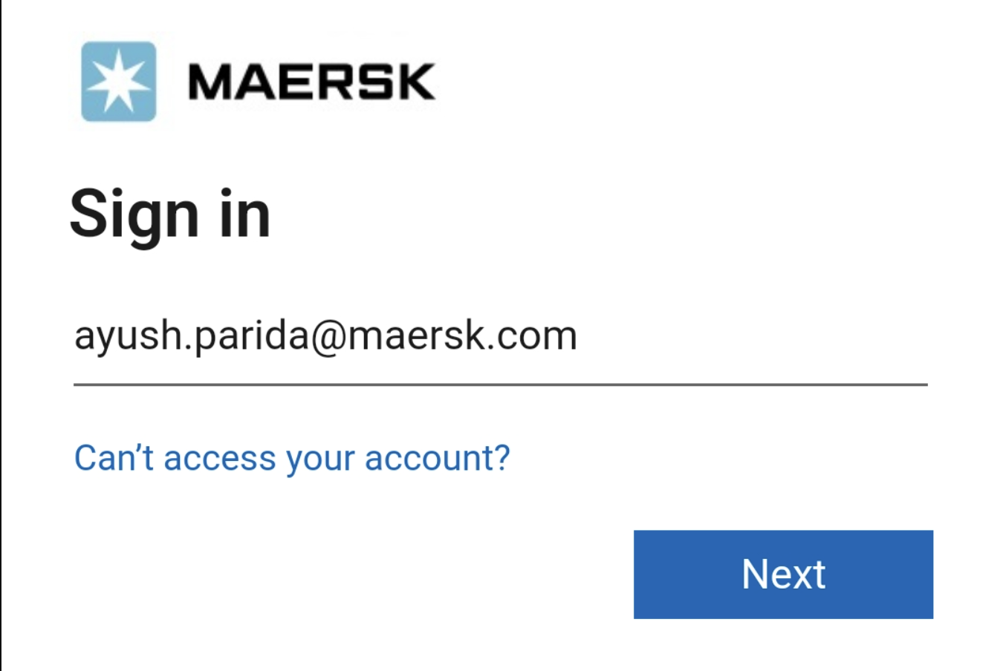
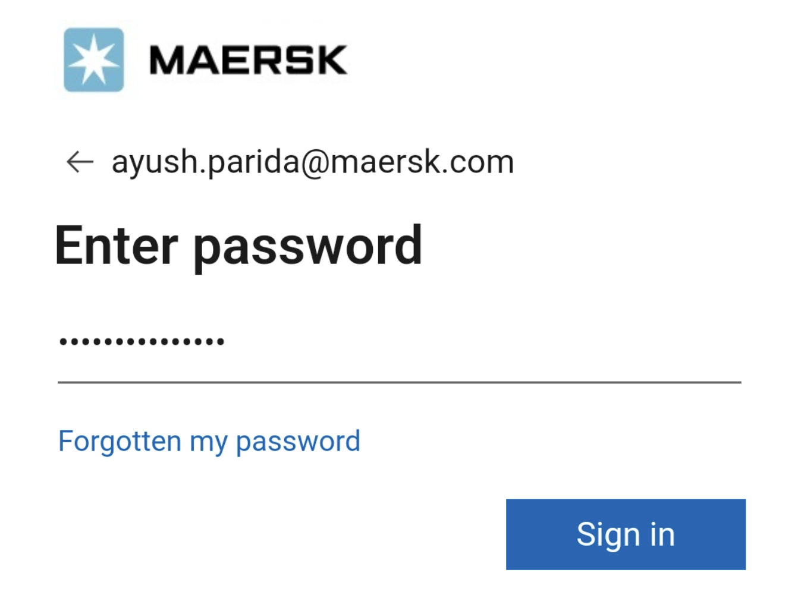
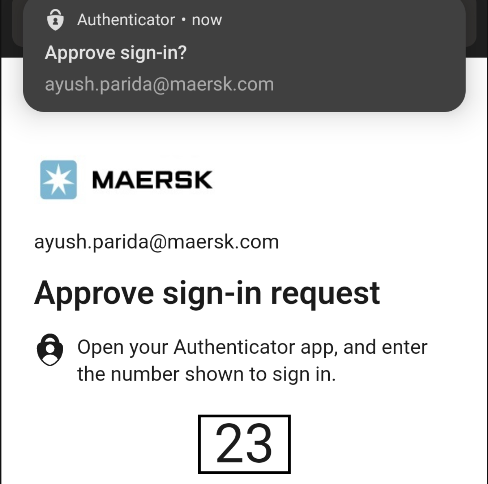
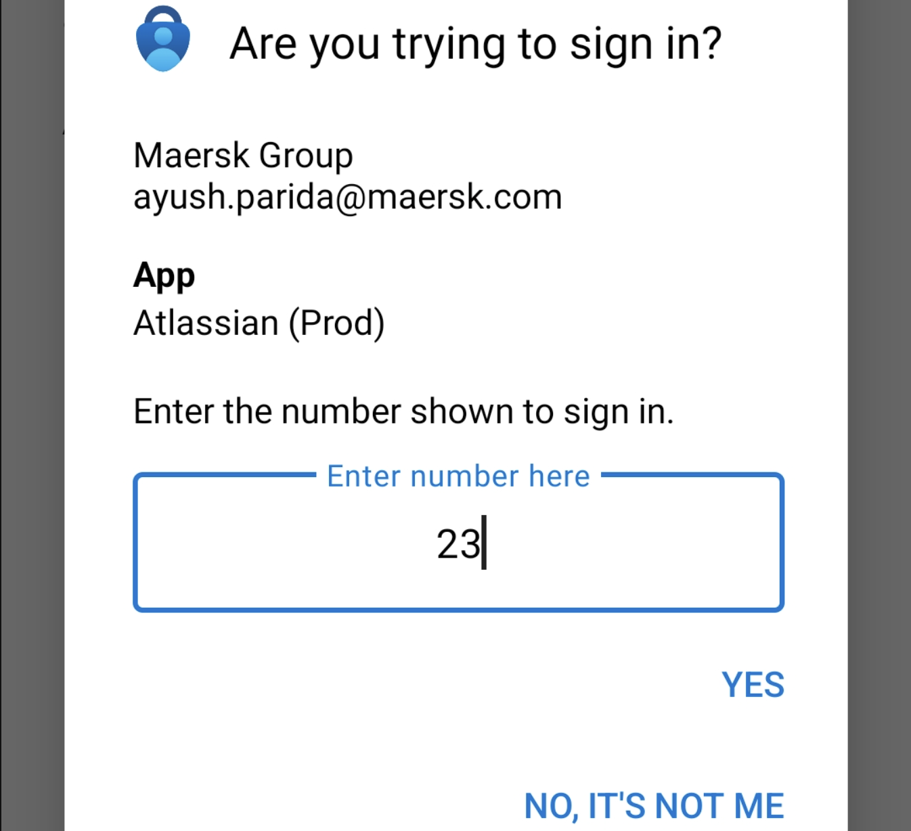

## What is MFA?

**Multi-factor authentication (MFA)** is an authentication technique that requires users to provide **multiple forms of identification**. MFA is a critical security practice that enhances the protection of accounts and systems by adding an additional layer of security beyond just a username and password. Here's an explanation of MFA:

## Authentication Factors

**1. Something You Know (Knowledge Factor):** This is typically something only the user knows, such as a password or PIN. It's the traditional method of authentication.

**2. Something You Have (Possession Factor):** This refers to something physical that the user possesses, such as a smartphone, hardware token, or smart card. These physical devices generate or display one-time codes that are used for authentication.

**3. Something You Are (Inherence Factor):** This involves biometric authentication, where the user's physical characteristics are used for verification. Examples include fingerprints, facial recognition, iris scans, and voice recognition.

## How MFA works?

MFA works by requiring users to provide at least two of the above authentication factors during the login process. Here's a simplified overview of how it works:
 
**1. User Initiation:** The user initiates the login process by providing their username and password (knowledge factor).
 
**2. Additional Factor:** After providing the password, the user is prompted to provide an additional authentication factor. This factor can be something they have (e.g., a one-time code from a mobile app) or something they are (e.g., a fingerprint scan).

**3. Verification:** The authentication system verifies both the knowledge factor (password) and the additional factor (e.g., the one-time code). If both factors are successfully verified, the user gains access.

Currently at Maersk, we only provide MFA through email. However, we are introducing context based risk analysis into the login journeys which will mandate MFA for some users and for some interactions. The system itself provides MFA options like

 

### Push Notification

Messages or alerts sent to a user's device or computer from a server or application

 

### Authentication using webAuthn

Modern web standard that allows users to authenticate themselves to web applications using strong, hardware-backed credentials, such as biometrics or cryptographic keys stored on a user's device. (Biometrics)

### Through an authenticator app

Mobile application that generates time-based one-time passwords (TOTPs) or provides other forms of secondary authentication to enhance the security of online accounts and services.

## Benefits of MFA

1. **Enhanced Security**: MFA significantly improves security by making it much harder for unauthorized individuals to gain access to accounts or systems, even if they have stolen or guessed a password. 
2. **Reduced Risk of Unauthorized Access**: Even if one authentication factor is compromised (e.g., a password is stolen), the attacker would still need the additional factor to access the account. 
3. **Protection Against Phishing**: MFA can protect against phishing attacks because even if a user unknowingly provides their password to a phishing site, the attacker won't have the additional factor required for access. 
4. **Compliance Requirements**: MFA is often required by regulatory standards and compliance frameworks to protect sensitive data and systems. 
5. **User Convenience**: While MFA adds an extra step to the login process, it provides a high level of security without requiring overly complex passwords.

## Common MFA Methods

**- Time-Based One-Time Passwords (TOTP):** Users generate a one-time code using a mobile app like Google Authenticator or Authy. 

**- SMS or Email Codes:** A one-time code is sent to the user's mobile phone or email, which they need to enter during login. 

**- Biometric Authentication(WebAuthn):** Users verify their identity through biometric characteristics like fingerprints or facial recognition. 

**- Hardware Tokens:** Users carry a physical hardware token that generates one-time codes. 

**- Push Notifications:** Users receive a push notification on their mobile device and approve the login attempt. 
