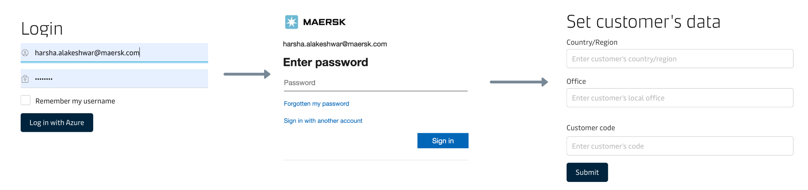
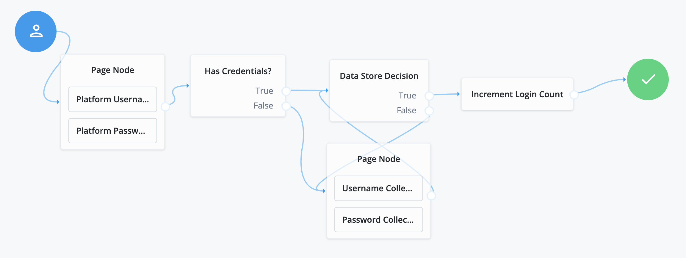

## Workforce Login through Azure AD

**Workforce users** on Maersk.com **use their AzureAD Identity** to login. These users are granted access based on the attributes on their azure token. These users identity is federated to our azure ad instance. 

## Trusted Partner Login through Okta

Similar to the above we have also built the capability for external users to login into Maersk.com using their identity provider. This system was used to allow Mars users to login into Maersk's 4PL offering, Neonav. Using Maersk.Com you can find a demo of the flow by following this video **[link](https://teamsite.maerskgroup.com/:v:/t/CIAM/EYJuKu_gpPBOtNjL7C1YueEB-B3UYbDy81uU9Iy7aYkvNQ?e=KxpyyA)**

## External User Login

A user can also login using their username and password. In this flow, we count incorrect logins, assess the authentication level of the user; 0 being basic and 5 being very secure and drive the login behaviour. Scenarios like account locking, time of last login are noted here.

