## PKCE

**PKCE (Proof Key for Code Exchange)** is an extension to the OAuth 2.0 protocol that prevents authorization code interception attacks. It is a simple, lightweight mechanism that can be implemented in any application that requests an authorization code.

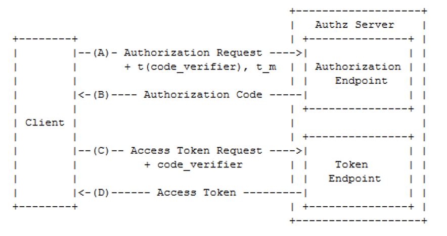

### Key Components and Techniques in PKCE

| TERMS                               | Description                                                                                                                                                                                                                                             |
|-------------------------------------|---------------------------------------------------------------------------------------------------------------------------------------------------------------------------------------------------------------------------------------------------------|
| 1. Code Verifier                    | The client generates a random code verifier, which is a high-entropy cryptographic string. This code verifier is typically of a certain length and contains a mix of characters (e.g., letters, numbers, and symbols).                                  |
|                                     |                                                                                                                                                                                                                                                         |
| 2. Code Challenge                   | The client then calculates a code challenge from the code verifier. The code challenge is usually a hashed version of the code verifier, often using a secure hash function like SHA-256. The code challenge is included in the authorization request.  |
|                                     |                                                                                                                                                                                                                                                         |
| 3. Code Challenge Method (optional) | The client specifies the method used to derive the code challenge in the `code_challenge_method` parameter of the authorization request. The most common method is S256 for SHA-256, but other methods could be supported in different implementations. |
|                                     |                                                                                                                                                                                                                                                         |
| 4. Authorization Request            | When initiating the OAuth 2.0 authorization process, the client includes the code challenge and other standard parameters like `client_id`, `scope`, `redirect_uri`, and `response_type` in the authorization request.                                  |
|                                     |                                                                                                                                                                                                                                                         |
| 5. Token Request                    | After the user grants consent, the client sends an authorization code request to the authorization server, which includes the authorization code received during the redirect, the original code verifier, and other parameters.                        |
|                                     |                                                                                                                                                                                                                                                         |
| 6. Code Challenge Verification      | The authorization server, when validating the code and code verifier, hashes the received code verifier using the method specified in the `code_challenge_method` and compares it to the code challenge provided in the initial authorization request.  |
|                                     |                                                                                                                                                                                                                                                         |
| 7. Token Response                   | If the code challenge matches the code verifier, the authorization server responds with an access token, an optional refresh token, and other relevant information, allowing the client to access protected resources.                                  |

### Detailed Overview Of PKCE Flow

1. **Initial Request**: Your application initiates the OAuth 2.0 authorization process by sending a request to the authorization server (e.g., an identity provider or an OAuth 2.0 provider).
2. **Code Challenge Creation**: Your application generates a unique code verifier.  - It then hashes the code verifier using a cryptographic hash function (typically SHA-256).  - The hashed value is the code challenge.
3. **Authorization Request**: Your application sends an authorization request to the authorization server, including the code challenge and other parameters like client ID, scope, redirect URI, etc. The server authenticates the user and asks for their consent.
4. **User Authentication and Consent**: The user is prompted to log in and grant permissions to your application.
5. **Authorization Code Grant**: If the user grants consent, the authorization server returns an authorization code to your application's redirect URI.
6. **Token Request**: Your application sends a token request to the authorization server, including the authorization code and the original code verifier.
7. **Code Challenge Verification**: The authorization server validates the code verifier by hashing it and comparing it to the code challenge it received earlier.If the verifier and challenge match, the server proceeds.
8. **Token Response**: If the verifier is valid, the authorization server responds with an access token, an optional refresh token, and other relevant information.
9. **Accessing Protected Resources**: Your application can use the access token to access the user's protected resources, such as their data on the resource server (e.g., an API).
10. **Token Renewal (Optional)**:If a refresh token was issued, your application can use it to obtain a new access token when the current one expires, without requiring user interaction.

PKCE adds a layer of security by ensuring that even if the authorization code is intercepted during the redirect, it cannot be exchanged for an access token without knowledge of the original code verifier. 

### Company Workflows

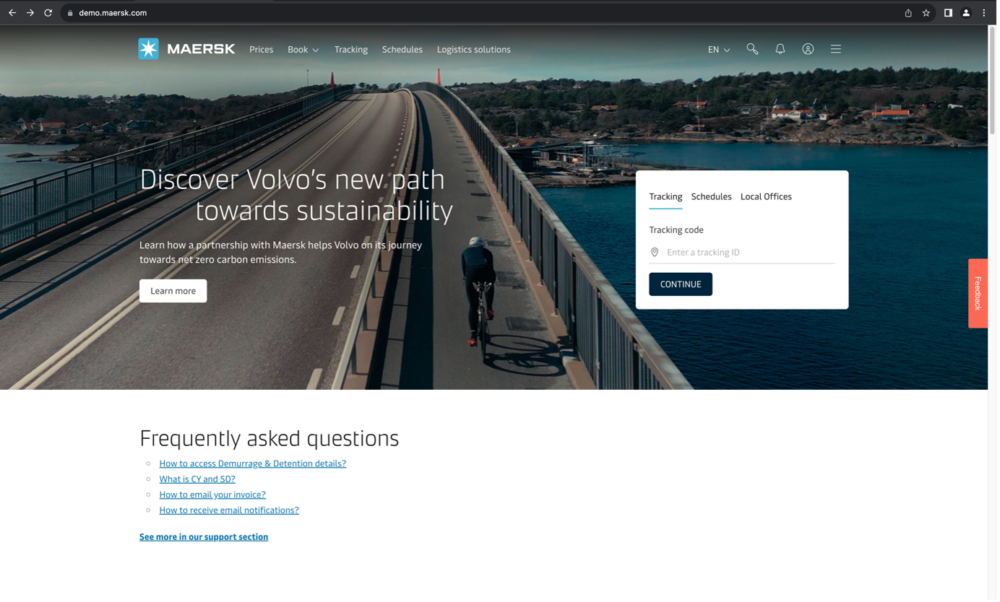

#### For First Time User

For first-time users, it is necessary to complete the registration process. After registering, an email verification step is required. Once the email verification is successfully completed, the user's registration will be considered successful.

**1. Register Yourself**

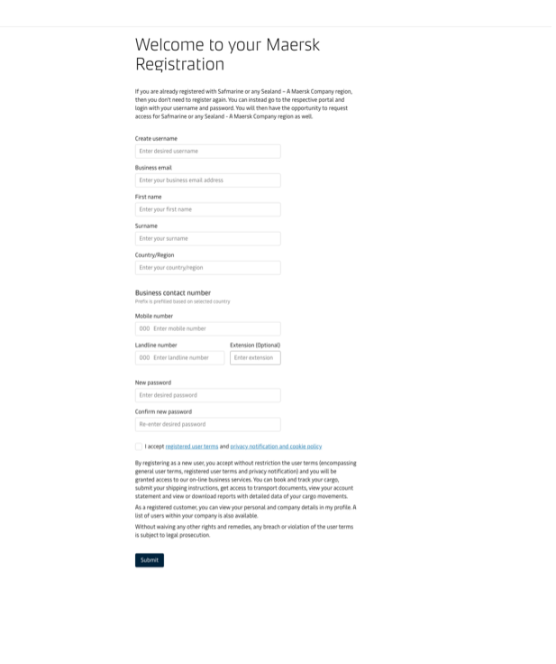
 
**2. Confirmation Of Successfull Registration**

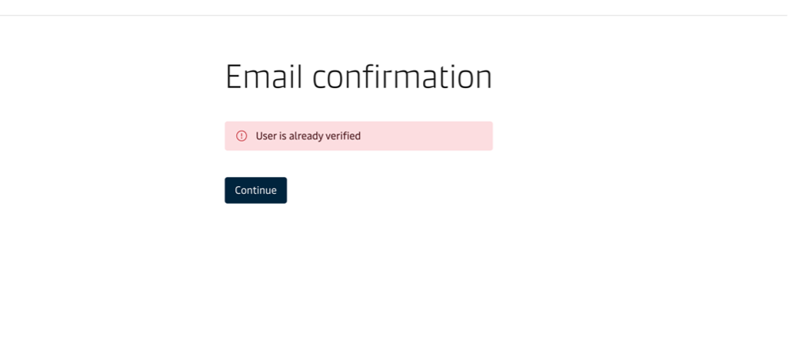
 
**3. Email Verification**

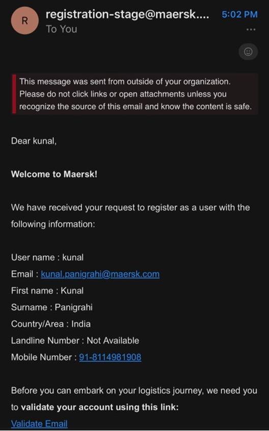
 
**4. Succesfull Verfication**

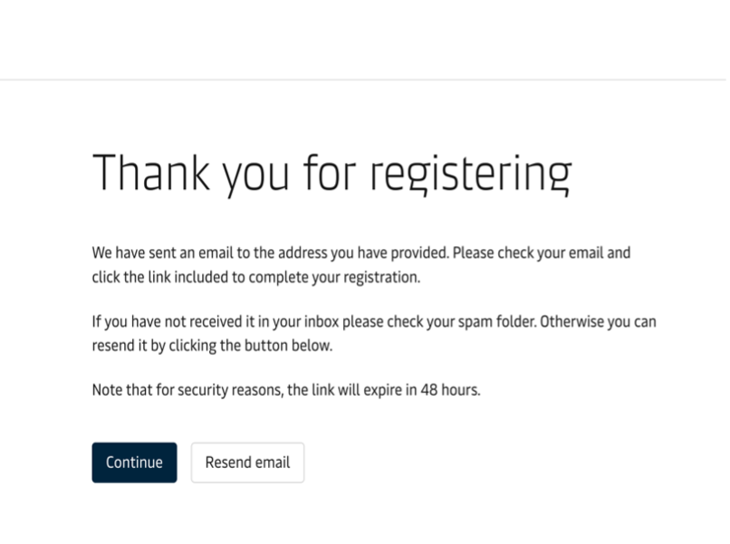

#### For Users with Company Account

While registering the user may have the company mail ID which immediately triggers a workflow wherein they can get themselves logged in through AzureAD as follows:

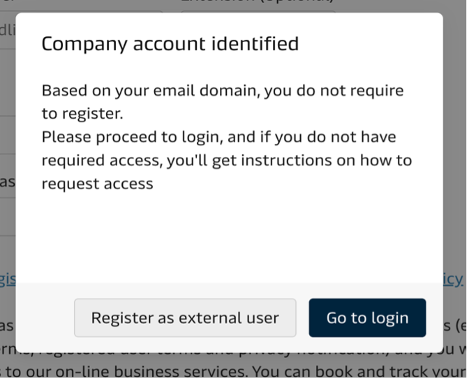 


#### For Existing User

**1. Login with Credentials**


## Implicit Flow

In the implicit grant flow, the client receives the access token as the result of the authorization request unlike the authorization code grant type, in which the client makes separate requests for authorization code and an access token. This is a redirection based browser only flow that it doesn’t authenticate the client.

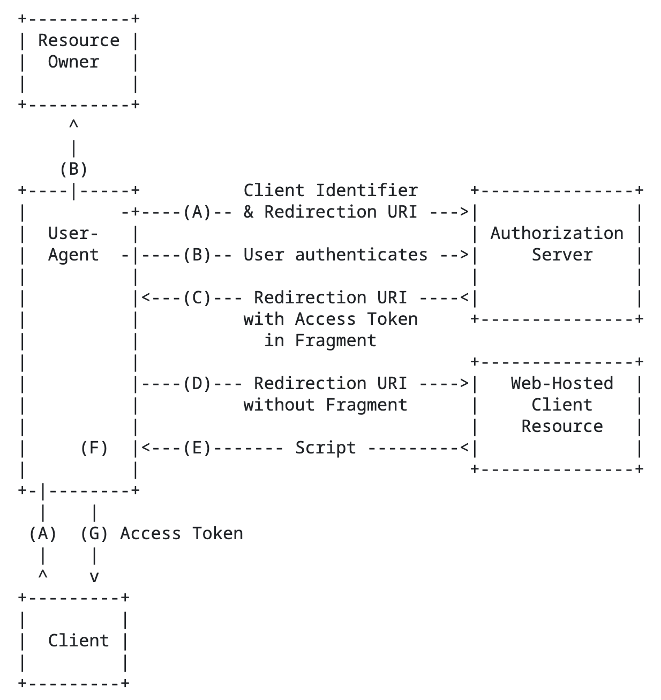

Here the communication takes place in the browser without the backchannel which is why this is relatively less secure than the normal code authorization flow. Data stays in the browser or the user agent of the Resource Owner which is why it can be accessed by other users. But due to less number of requests, this method is relatively faster.

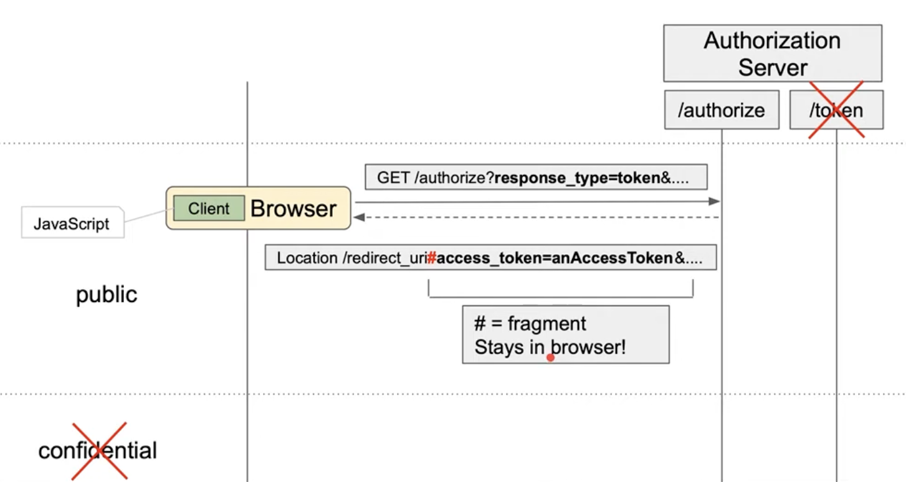

### Detailed Overview of Implicit Grant Flow

1. **The client initiates the flow** by directing the resource owner's user-agent to the authorization endpoint. The client includes its client identifier, requested scope, local state, and a redirection URI to which the authorization server will send the user-agent back once access is granted (or denied). 
2. **The authorization server authenticates the resource owner** (via the user-agent) and establishes whether the resource owner grants or denies the client's access request. 
3. Assuming the resource owner grants access, **the authorization server redirects the user-agent back to the client** using the redirection URI provided earlier.  The redirection URI includes the access token in the URI fragment. 
4. **The user-agent follows the redirection instructions** by making a request to the web-hosted client resource.  The user-agent retains the fragment information locally. 
5. **The web-hosted client resource returns a web page** (typically an HTML document with an embedded script) capable of accessing the full redirection URI including the fragment retained by the user-agent, and extracting the access token (and other parameters) contained in the fragment. 
6. **The user-agent executes the script provided by the web-hosted client resource** locally, which extracts the access token. 
7. **The user-agent passes the access token to the client.**

### Company Workflow

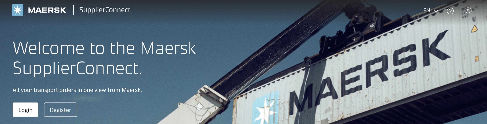

#### For First Time Users

1. Register ourselves

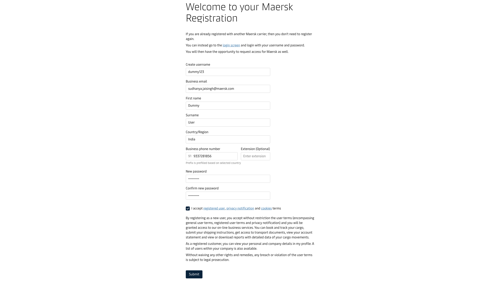

2. Confirmation of successful registration

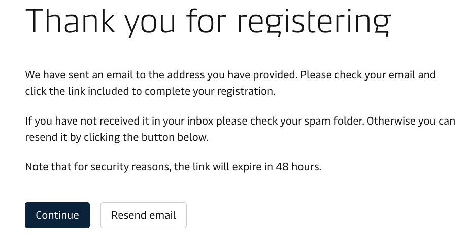

3. Email verification
 
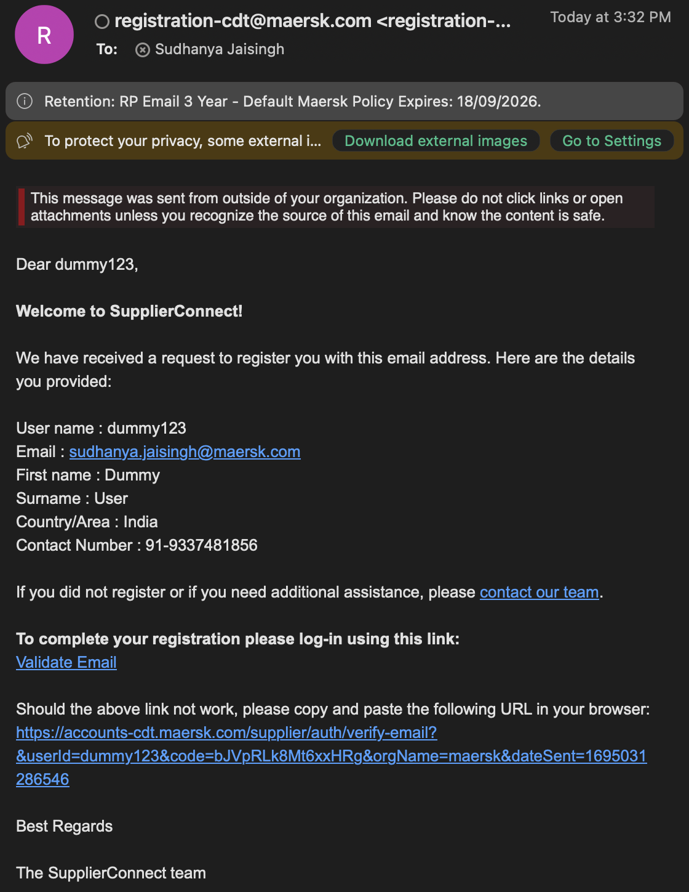

4. Successful registration

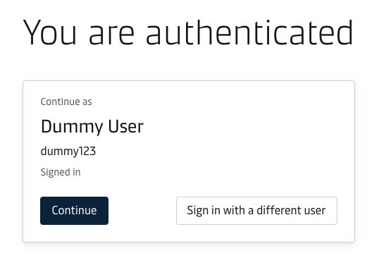

#### For Users with Company Account

While registering the user may have the company mail ID which immediately triggers a workflow wherein they can get themselves logged in through AzureAD as follows:

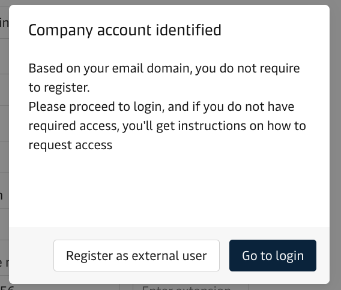 

If the user wants to register as an external user then they may select the first option.

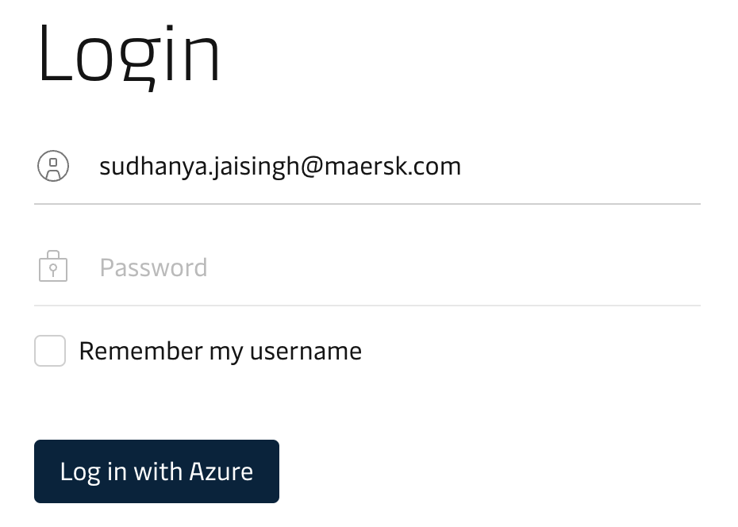

#### For Existing Users

1. Login with Credentials: 

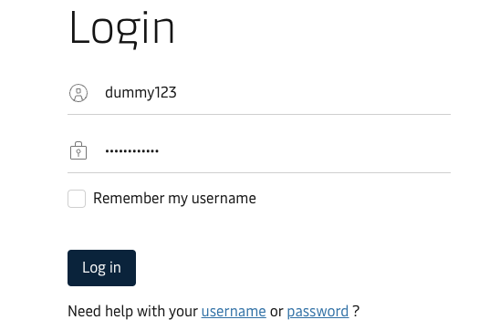

***The network logs show us that the response we received in request for access was an id_token allowing us access to the site's resources.***

```
client_id=bca001
decision=allow
redirect_uri=https%3A%2F%2Fcdt.supplierconnect.maersk.com%2Fauth%2Fgate.html
response_type=id_token
token&scope=openid%20profile%20emai
```


2. Success

This flow grants us access using the access token directly rather than requesting for an authorization code to get the said token. 


#### For Upgrading an User

1. Request for an upgrade to gain access of more in-built features

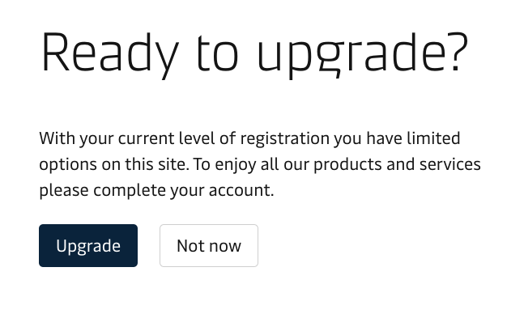

2. Fill out the details

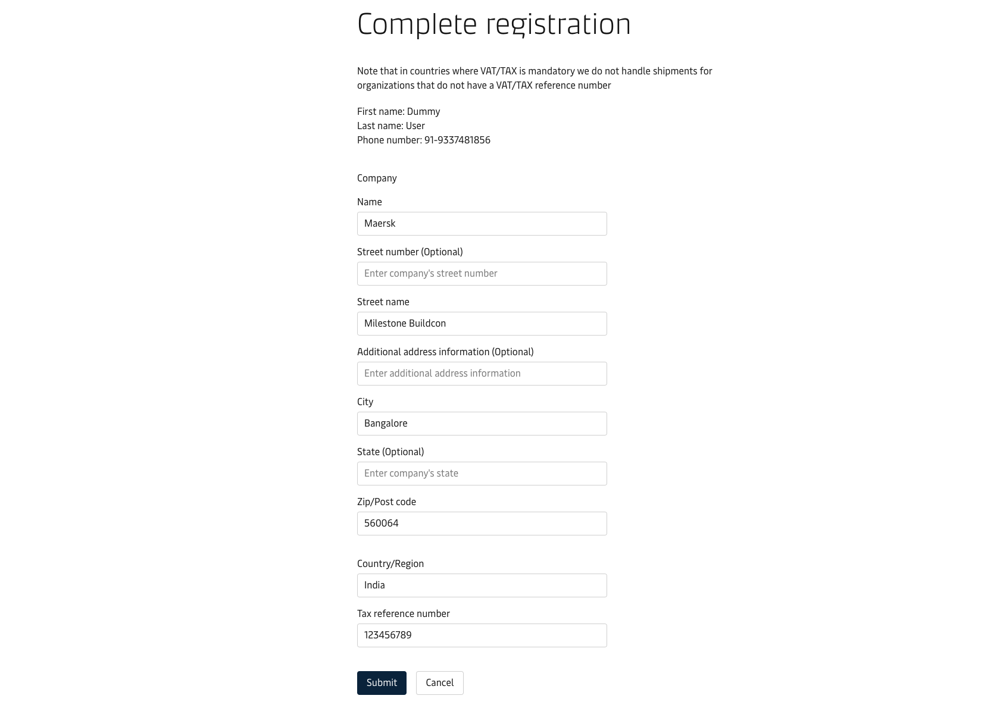

3. Confirmation for updating an existing user

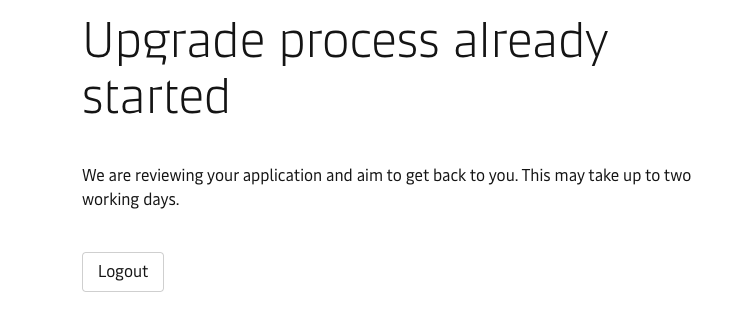

## Client Credentials

The **Client Credentials** Flow is one of the OAuth 2.0 authorization flows used for obtaining access tokens when a client application needs to authenticate and authorize itself rather than a user.

It is also called  Machine-to-Machine (M2M) and used in different application like CLIs, **[daemons](## "daemons are background processes or services that run continuously, often without direct user interaction, to perform various tasks")**, or backend services and server to server communication because the system must authenticate and authorize the application instead of a user.

The Client Credentials Flow involves an application exchanging its application credentials, such as client ID and client secret, for an access token.

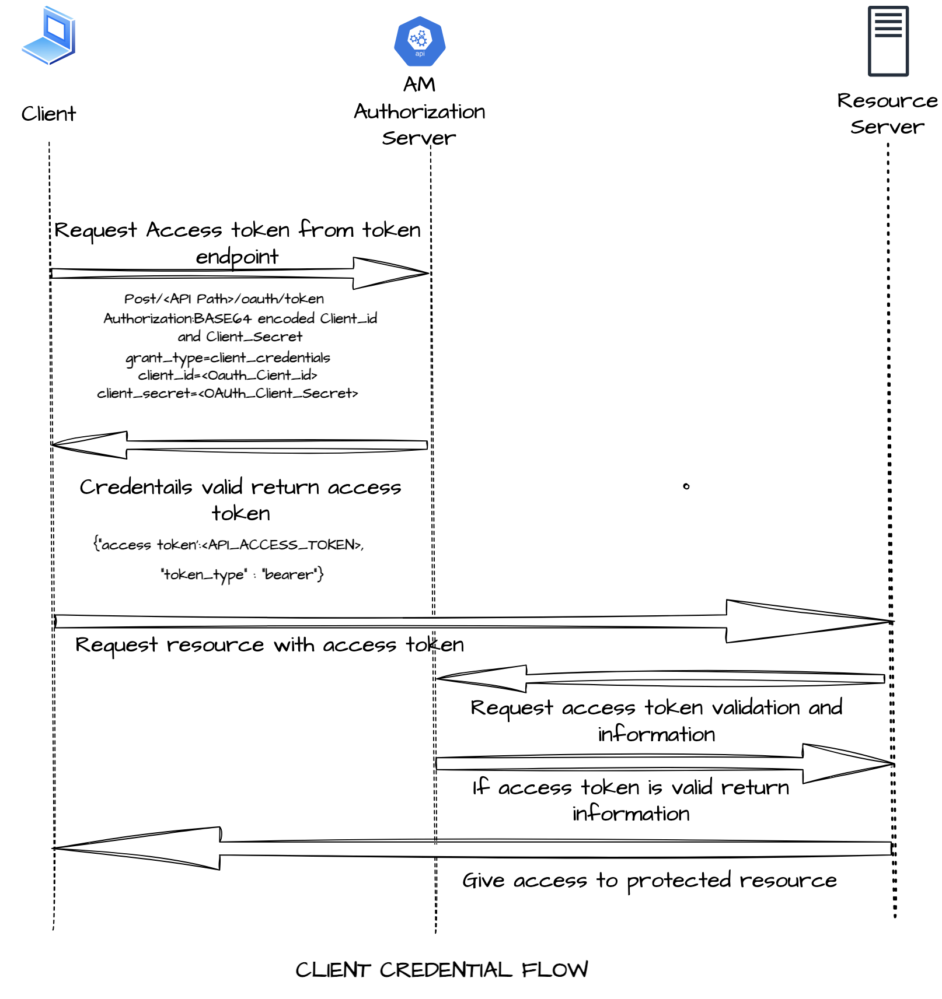

### Detailed Overview of Client Credentials Flow

<!-- Add the data here -->

It is currently used in Maersk during service to service and not for server side to fetch any data .We are protecting the API using the consumer key which is configured on **[Apigee](https://cloud.google.com/apigee/docs/api-platform/get-started/what-apigee "It is responsible for the design, development and testing of API proxies and software applications")** .A client is registered at our AM and we have provided the client with client credentials and secret.

Apigee allows us to access API only if our consumer key is in the request and the service returns a appropriate response only if the token is valid and has required access .

After Authorization we recieve an Access token which is actually an JWT token which is used for further authorization when the user want to access the site once more where the access token acts as the identity provider and authorizes your identity.

### JWT

JWT stands for **JSON WEB TOKEN** is a value token based authorization service that comes after a user is authenticated properly and it used RFC 7519 for its internal structure.It is used for both static and dynamic websites.<br><br>

JWT takes out the need of client data getting stored at server side.In JWT the user contains all his/her data at client browser and when access is needed the URL containing JWT token is sent and access is granted on verification.After Each session the Client verifies itself again and again using JWT. <br><br>

The JWT lies in client side in cookies or storage form and is signed by server while getting authorized and is changed on by server whenever a change is seen on the token part.This is for security puposes.In order for further security the server side signs the token using a secret key which is possesed by only the server side.

The JWT Token is a basse64 encoded string format with three dots(.) representing three different parts of the token:-

* Header
* Payload
* Signature

#### Header

The JWT header is the first part of a JWT and is typically represented as a JSON object.In Maersk it consists of three main pieces of information:

1. **Token Type (typ)**: This field indicates the type of token being used. For JWTs, this field is typically set to "JWT".

2. **Signing Algorithm (algo)**: This field specifies the cryptographic algorithm used to sign the JWT. It indicates how the signature within the token was generated.In Maersk the RS256 algorith is used for signing.

3. **KID (Key ID)**: is an optional field that can be used to provide a hint or identifier for the key used to sign the JWT. It is used to help the recipient of the JWT locate the correct cryptographic key to verify the token's signature.It is primarily used as in maersk there are multiple keys used for signing diffrent document so there can be **multiple server keys**.

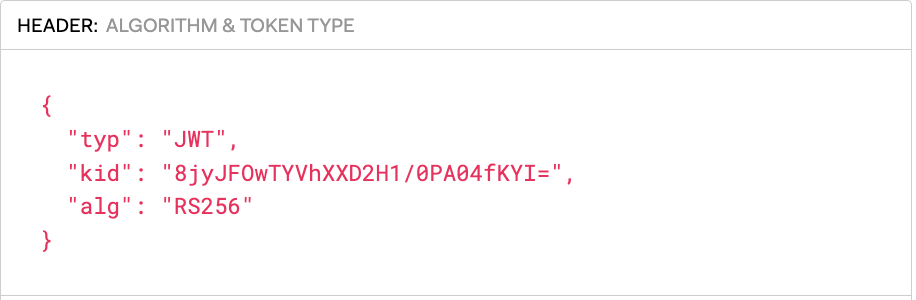

#### Payload

1. The payload is used to convey information such as user identification, permissions, and metadata.This contains user primary data that the user wants to share with the server in order to authorize.<br>

2. Mostly **[claim](## "A claim is a piece of information or satement on behalf of end user that the relying party or client can use to provide them a service.")** **based data authentication** is used.

Here the payload descirbes the name,scope,authentication type used,authorization time,access type etc. The payload should not contain any personal or confidential data like password,client secret etc.

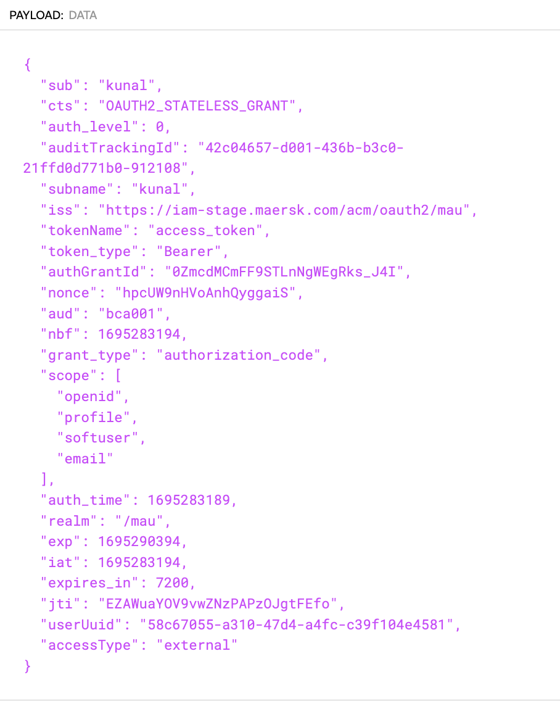

#### Signature

1. The signature is the third and final part of the token. It plays a crucial role in ensuring the integrity and authenticity of the JWT, making it tamper-evident. The signature is used to verify that the JWT has not been altered in transit and that it was indeed issued by a trusted party.

2. The algorithm specified in the header is used calculate signature which contains server secret and a combination of encrypted header and payload.

3. The Signature is only changed when a value of header or payload is changed and is incorporated by server and the user needs to validate the JWT again.


##### How Signature Verification Works?

* **Header and Payload**: The header and payload of the JWT are Base64Url-encoded to create the first two parts of the token: the header and the payload. These parts are concatenated together with a period ('.') as the separator, resulting in a string like this: Base64Url(header).Base64Url(payload).

* **Signature Creation**: The JWT issuer takes this concatenated string and signs it using a secret key (for HMAC-based algorithms)by the server or a private key (for asymmetric algorithms). The choice of signing algorithm and the key used for signing are specified in the JWT header.

* **Complete JWT**: The complete JWT consists of three parts: the Base64Url-encoded header, the Base64Url-encoded payload, and the signature. These parts are concatenated with periods ('.') as separators.The format is like base64Url(header).base64Url(payload).Signature.

##### Verification Steps

1. Decodes the Base64Url-encoded header and payload to access the claims and header information.

2. Retrieves the public key (in the case of asymmetric algorithms) or shared secret (in the case of HMAC algorithms) associated with the issuer.

3. Reconstructs the concatenation of the decoded header and payload and computes a own new  signature using the same algorithm and the retrieved key or secret key in server.

4. Server side then Compares the computed signature to the signature included in the JWT.

5. If the two signatures match, the JWT is considered valid and has not been tampered with. Otherwise, it is rejected.

#### Maersk Flow

<!-- Add the data here -->

#### Security Concerns and Solutions of JWT

1. If there is any confidential data like password or secret is leaked to the middle man then it can lead to security concerns.

2. Session Hijacking which is dominant in hacking should be countered by providing encryption at transport layer.

3. There is no expiration or token invalidation.It can be tackled by using a expiry time claim.If the token excedes the claim time stamp then we can put it in the **token black

##### Why JWT?

There are different ways of authorization:-

1. Session token

1. JSON web token

In authorization we use HTTP protocol and it is a **[stateless](https://stackoverflow.com/questions/13200152/why-is-it-said-that-http-is-a-stateless-protocol "It does not contain data from previous session.")** interaction.In http every interaction we need to send all the required details in order to access the required server or service.

**For Example**:

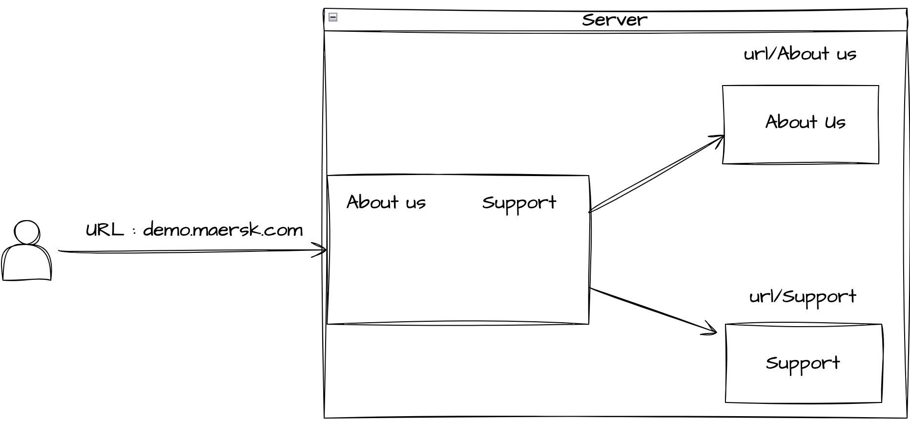

* When a user tries to acess to the url and the user lands on the landing page of (demo.maersk.com) and there are two other pages about us and support and for instance the user tries to access the **about us**,The page will redirect but due to the HTTP service the server side will not be able to determine who is trying to acess this page as the request does not contain the previous data about the user trying to access.(There is dependance on previous information).<br><br>

* In order to tackle this **session token** was used where the server has a Session Log like a table for all the session Id's given out to the multiple users on the basis of multiple session.The session id is storeed as a **cookie** and is send as cookie header along with URL.When the user tries to access a different URL like **/support**,The server looks up the session provided by the user and matches it up,If matched it grants the access of the next page.

**Modern web apps are modular and are distributed across not just one but many server**.So when a session is registered in one server and a load balancer routs user request to another server the server unknown of the user session id in server1 will be unable to perform the required action.

* In order to tackle this a shared session cache(redis) that all the different server will be connected to is used.The problem is if the cache session goes down all the server are at a point of failure.

* Another alternative was to follow a sticky session pattern where the load balncer remembers which server has the given session id verified and redirects the current user to the preffered server,But it was not scalable for larger servers like large number of microservices server.

So JWT was inroduced. Rather than registering all the details of the user in system and handing out the token the details and the interaction specifics were written down on a token and was handed down to the user.So in each and every interaction the user provides the token to the server in every subsequest interaction and the server gets the details from this token.

The server backend does not remember anything the it's the users responsibility to handle these tokens.

The server assigns the token and signs it for protecting it against further tampering and malicious user access.

## ROPC Flow

The ROPC flow uses a set of credentials i.e. a username and password provided to the authorization server by the user to get an access token. This flow is utilized only when there is high degree of trust between the Resource owner and the client. This flow involves exchange of credentials which is sensitive information and thats what makes this a relatively insecure flow vulnerable to attacks.

### Detailed Overview of ROPC Flow

1. The client requests token by calling the **[token endpoint](## "The token endpoint is used by the client to obtain an access token by presenting its authorization grant or refresh token.")** .
2. Authorization server validates user credentials.
3. When user credentials are valid, then Authorization server returns the access and ID tokens.
4. User gets authenticated.
