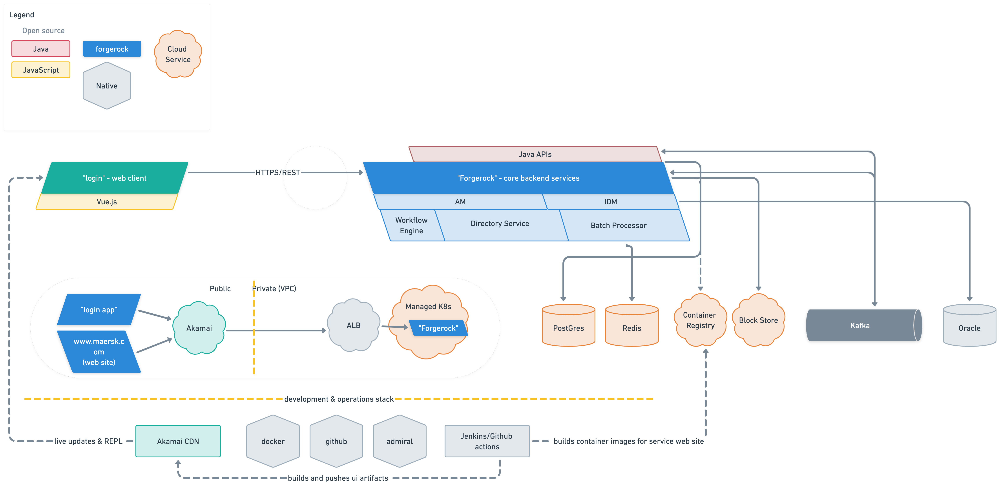
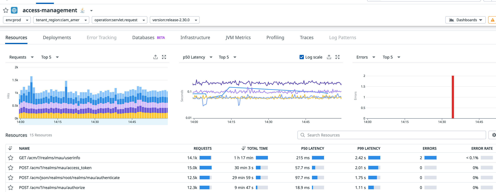
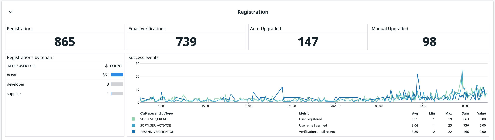

## Highlevel architecture

CIAM and KYC team provide multiple capabilities and these capabilities are provided by multiple services and systems working together. You can see a high level diagram of our architecture here



## Installation

The way we monitor these services is through datadog. We have three kubernetes clusters running in production and we install Datadog agents on everynode and enable autodiscovery on them. We specify this a pod annotations in kubernetes. 

``` yaml
annotations:
  ad.datadoghq.com/<CONTAINER_IDENTIFIER>.check_names: '[<INTEGRATION_NAME>]'
  ad.datadoghq.com/<CONTAINER_IDENTIFIER>.init_configs: '[<INIT_CONFIG>]'
  ad.datadoghq.com/<CONTAINER_IDENTIFIER>.instances: '[<INSTANCE_CONFIG>]'
```

## Metrics

The Datadog agent's list of integrations include openmetrics and prometheus. Based on the auto discovery approach described above, the integration for prometheus metrics endpoints can be configured for applications exposing them.

As per Datadog recommendation the configuration described in this section is for the openmetrics integration, since it's more efficient and supports fully the prometheus metrics format.

The annotations described in the auto discovery section need to be integrated into the component helm charts. 

As an example, the annotations of a deployment.yaml are set the following way:

``` yaml
spec: 
  template:
    metadata:
      annotations:
        ad.datadoghq.com/acme.check_names: |
          ["openmetrics"]
        ad.datadoghq.com/acme.init_configs: |
          [{}]
        ad.datadoghq.com/acme.instances: |
          [
            {
              "prometheus_url": "http://<>/metrics/prometheus",
              "namespace": "ciam",
              "metrics": ["*"]
            }
          ]
```

## APM 

We use application monitoring to get insights into how the service is running. This telemetry has been crucial in identifying performance bottlenecks in the code and in the infrastructure. To enable this 
we pull the datadog agent jar for apm and embed it into the build process. We will need to inject variables for the agent path, version and URL  



## Logs

Application logs are critical to debugging. We needed to balance volume of logs and their necessity. As such we decided not to push the node logs into DDog and decided to use fluentbit as an intermediary agent to store and push the data. To do this we used a new output plugin that pushes these logs into datadog
 
``` yaml
[OUTPUT]
    Name                         datadog                            # Plugin type
    Match                        audit                              # References the input plugin Tag
    Host                         http-intake.logs.datadoghq.eu      # Log collection url
    TLS                          on                                 # Secure communication
    compress                     gzip                               # Compression format (gzip supported)
    apikey                       ${DD_APIKEY}                       # Env - Allow queries to the DataDog API for the given organisation.
    dd_service                   ${DD_SERVICE}                      # Env - Name of the service.
    dd_source                    ${DD_SOURCE}                       # Env - Name of the source.
    dd_message_key               event                              # Message key set as event due to filter nest.
    dd_tags                      ${DD_TAGS}                         # Env - Tags in key:value format
```

These logs are indexed and kept for a week in DDog and archived in LogDNA. We can also use these logs to create monitors and create dashboards. Some of the dashboards like login overview and the registraton overview are driven from this




We implement the above monitoring and logging mechanisms to track the performance and behavior of our deployed services. We monitor metrics like Errors, latency, Saturation and Throughput to track the health of the platform. We had used tools like Prometheus, Grafana and now use tools like Datadog for effective monitoring, logging and tracing.

Learn more about observability on our platform by reading our confluence documents [here](https://maersk-tools.atlassian.net/wiki/spaces/IAM/pages/129757916256/DataDog+integration) . 
You can also get insights into the usage of the platform by going [here](https://maersk-bridge.datadoghq.eu/dashboard/jc2-tij-mzk/ciam-tech-demo?from_ts=1687094078875&to_ts=1687180478875&live=true)