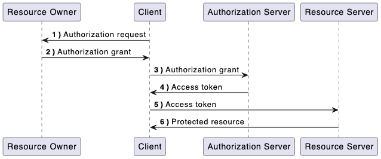

## OIDC

OIDC stands for "OpenID Connect." It is an authentication and authorization protocol built on top of OAuth 2.0. OIDC adds an identity layer to OAuth 2.0, allowing clients (applications or websites) to verify the identity of end-users based on the authentication performed by an authorization server, as well as to obtain basic profile information about the users. The main benefit of using OpenID Connect is that it provides a completely standardized setup. Since it is built on OAuth 2.0, it is API-friendly. It extends the OAuth 2.0 protocol with support for authentication so that the client can verify the identity of its users.

### How do we Implement it?

We implement an **authentication server** that implements OpenID Connect and is referred as an **[OpenID Provider(OP)](## "Web service that facilitates the authentication of users and provides identity information to relying parties (RPs) or service providers")**. In that role we issue **[ID tokens](## "ID token provides proof of the user's authenticatio")** to our protected systems like Maersk.Com. We also consume ID Tokens from other Identity providers like Azure AD and Okta and in those scenarios we become a relying party. 

**Purpose:** Gives users a way to authenticate to a service by providing it with a subset of their data in a secure way. Because **OIDC extends OAuth 2.0**, users can authorize a relying party to collect a subset of their data (usually information stored in the user’s profile); it can be **claims** like personid used by MCom. The service then uses this data to authenticate the user and provide its services.

The OIDC journey issues ID tokens. **Scopes** can be mapped to specific user data. Claims are returned as part of the ID token. In some cases, additional claims can be requested in a call to the **[oauth2/userinfo endpoint](## "This endpoint allows client applications (relying parties) to request additional user information or claims beyond what is available in the ID token (if OpenID Connect is used) or access token")**.

### Key Points of OIDC

1. **Authentication**: OIDC provides a standardized way for clients to authenticate end-users. It allows clients to confirm the identity of the user, typically through username/password, social identity providers (e.g., Google, Facebook), or multi-factor authentication.

2. **ID Tokens**: When an end-user is authenticated, the OIDC authorization server issues an ID token, which is a JSON Web Token (JWT). The ID token contains user information (claims) and is used by the client to verify the user's identity.

3. **UserInfo Endpoint**: OIDC introduces a UserInfo endpoint where clients can retrieve additional user information beyond what's available in the ID token. This provides a standardized way to access user profile data.

4. **Single Sign-On (SSO)**: OIDC enables Single Sign-On, allowing users to log in once to access multiple applications without needing to re-enter their credentials repeatedly.

5. **Authorization**: While OIDC focuses on authentication, it often works in conjunction with OAuth 2.0 for authorization. OAuth 2.0 deals with access to resources, while OIDC handles user authentication and identity.

6. **Security**: OIDC incorporates security features such as token validation, token expiration, and signature verification to ensure the integrity and authenticity of identity-related data.

7. **Scopes**: OIDC uses scopes to request specific user information during authentication. Scopes define the level of access to user data that a client can request.

8. **Open Standards**: OIDC is based on open standards and is widely adopted, making it a reliable choice for identity and authentication in modern applications.

OIDC is commonly used in scenarios where user authentication and identity verification are crucial, such as in web and mobile applications, Single Sign-On (SSO) solutions, and when integrating with identity providers (IdPs) like Google, Microsoft, and others. It provides a secure and interoperable way to handle user authentication and identity management in a standardized manner.

## OAuth 2.0

**OAuth2.0** is a standard framework designed to allow a third party application to access resources hosted by other web apps on behalf of an **user(Resource Owner)**. It can be achieved by sending an **authorization request** for an **access token**, or letting the third party application access on its own behalf. The following sequence diagram demonstrates the basic **Oauth2.0 flow**

### Basic OAuth2.0 Terms

- **Resource Owner:** Owner of the resource also referred to as the User. They use an **[user agent](## "Software or a program that acts on behalf of a user when interacting with a computer system, network, or web service")**(usally a web browser) to communicate with a client
- **Client:** A **[third party application](## "Software application developed by an entity or organization that is not the creator or owner of the platform or service on which the application operates")** that wants to access the resources hosted by the Resource Owner. Client makes requests on behalf of the resource owner with their authorization
- **Authroization Server:** Authenticates the resource owner and/or client, issues tokens to client and tracks their validity
- **Access token:** Proves that resource owner authorizes the client to act on their behalf over specific resources during limited periods of time
- **Resource Server:** It is the server hosting the protected resources. The server **must be able to validate tokens** issued by the authorization server. A website protected by a **[web/java agent](## "Software component or program designed to perform specific tasks or functions within a web application or Java-based application")** can be a resource server.
- **Scopes:** Scopes define the **information** that need the authorization of the Resource owner to be shared to get access to the requested resource.
- **Consent:** It is the agreement that the Resource owner has agreed to share the requested resources.

### The current implementation of IAM Maersk supports

* Authorisation Code
* **Authorisation Code PKCE**
* **Implicit**
* Resource owner password credentials
* **Client credentials**