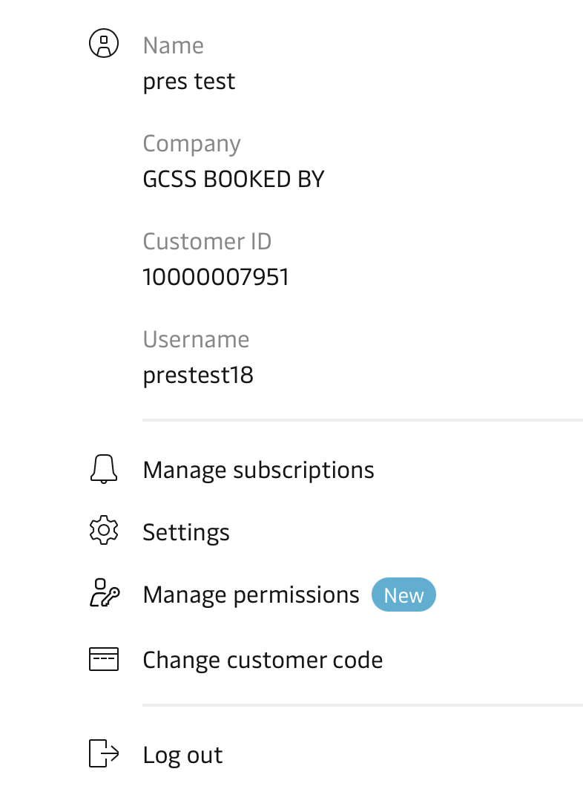

## Administration Portal

The user administration portal is designed to streamline the management of customer user accounts and permissions within the organization. Through the portal, administrative accounts gain the ability to efficiently modify user details and permissions, ensuring that the right individuals have access to the appropriate resources and information. The administrative accounts can be given access to modify for only subset of users, such as Ocean, SCM, Supplier Portal, Neonav, etc. and this is controlled through ForgeRock Identity Management.

One of the primary functions of the portal is to handle user onboarding for customers when manual intervention is required. Administrative accounts can oversee the approval process for new customers, reviewing and either approving or rejecting their onboarding requests based on the data provided during the upgrade journey. This functionality enables the organization to efficiently and securely bring new customers into the system, ensuring a smooth and controlled onboarding experience.

The manual upgrade request could be a result of multiple scenarios, depending on the choices taken and data provided or found throughout the upgrade process. Some of those scenario include:
  * User has chosen a blacklisted country during registration.
  * User email domain doesn't match customer url from BVD search.
  * User opted to enter customer details manually after BVD search.
  * User email domain is blacklisted.

For any of these scenarios the registering user will also be prompted to upload their documents.
Stewards from E-registration / E-comm / Live help / Area Data Stewards who are responsible to maintain the customer data and registrations can access these documents using Maersk Document Management UI will need view access to these documents. The documents uploaded will be available on the manual upgrade requests in the administration portal.

## Customer permission management

The manage permissions functionality offers customers the ability to oversee and control the access privileges of users associated with their organization. Once a customer is onboarded, they can have multiple users registering and after it is established that they belong to the same organisation, linked to their customer code, each with their own set of roles.
With this functionality, customers gain visibility into the permissions of all users associated with their "home" organization. They can easily view and assess the access levels granted to each user, ensuring that the right individuals have appropriate privileges.
Furthermore, the platform allows customers to exercise control over user access by providing the ability to revoke access if necessary. In situations where a user's access needs to be revoked, customers can take swift action to safeguard their organization's sensitive data and prevent unwated actions being taken.

Looking towards the future, the manage permissions functionality aims to provide even greater flexibility and granularity. Customers will soon have the capability to revoke individual permissions roles for specific users. This added level of control ensures that customers can fine-tune access rights based on evolving needs, optimizing security and minimizing potential risks.